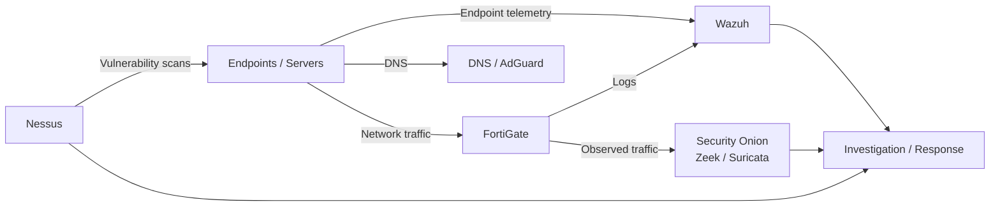

# Security Data Flow

```mermaid
flowchart LR
    ENDPOINTS["Endpoints / Servers"]
    FW["FortiGate"]
    DNS["DNS / AdGuard"]
    W["Wazuh"]
    SO["Security Onion<br/>Zeek / Suricata"]
    N["Nessus"]
    IR["Investigation / Response"]

    ENDPOINTS -->|"Endpoint telemetry"| W
    ENDPOINTS -->|"DNS"| DNS
    ENDPOINTS -->|"Network traffic"| FW
    FW -->|"Logs"| W
    FW -->|"Observed traffic"| SO
    N -->|"Vulnerability scans"| ENDPOINTS
    W --> IR
    SO --> IR
    N --> IR
```

