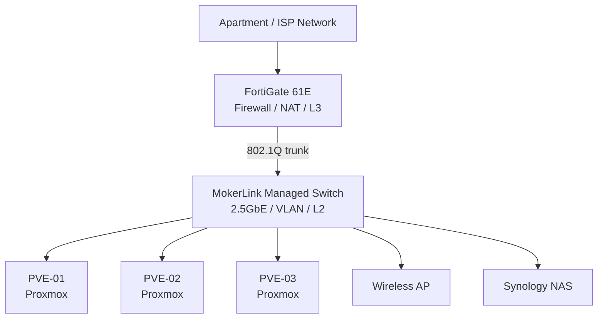

# Network Topology Diagram

```mermaid
flowchart TB
    ISP["Apartment / ISP Network"]
    FW["FortiGate 61E<br/>Firewall / NAT / L3"]
    SW["MokerLink Managed Switch<br/>2.5GbE / VLAN / L2"]
    N1["PVE-01<br/>Proxmox"]
    N2["PVE-02<br/>Proxmox"]
    N3["PVE-03<br/>Proxmox"]
    AP["Wireless AP"]
    NAS["Synology NAS"]

    ISP --> FW
    FW -->|"802.1Q trunk"| SW
    SW --> N1
    SW --> N2
    SW --> N3
    SW --> AP
    SW --> NAS
```
