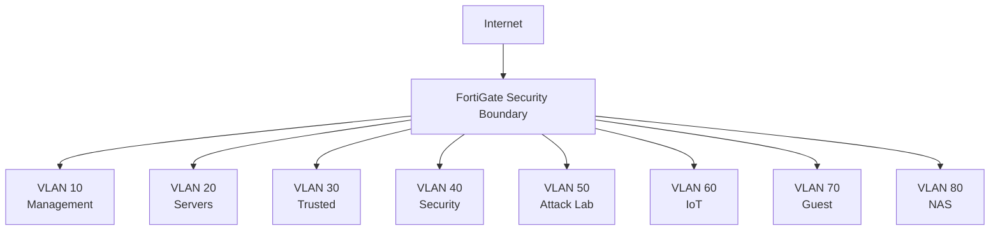

# Security Zones

```mermaid
flowchart TB
    INTERNET["Internet"]
    FW["FortiGate Security Boundary"]

    MGMT["VLAN 10<br/>Management"]
    SERVERS["VLAN 20<br/>Servers"]
    TRUSTED["VLAN 30<br/>Trusted"]
    SECURITY["VLAN 40<br/>Security"]
    ATTACK["VLAN 50<br/>Attack Lab"]
    IOT["VLAN 60<br/>IoT"]
    GUEST["VLAN 70<br/>Guest"]
    NAS["VLAN 80<br/>NAS"]

    INTERNET --> FW
    FW --> MGMT
    FW --> SERVERS
    FW --> TRUSTED
    FW --> SECURITY
    FW --> ATTACK
    FW --> IOT
    FW --> GUEST
    FW --> NAS
```
