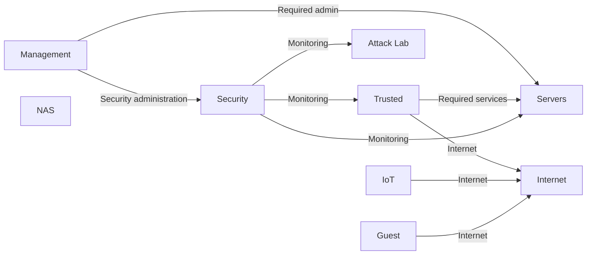

# Traffic Policy

```mermaid
flowchart LR
    MGMT["Management"]
    SERVERS["Servers"]
    TRUSTED["Trusted"]
    SECURITY["Security"]
    ATTACK["Attack Lab"]
    IOT["IoT"]
    GUEST["Guest"]
    NAS["NAS"]
    INTERNET["Internet"]

    MGMT -->|"Required admin"| SERVERS
    MGMT -->|"Security administration"| SECURITY
    TRUSTED -->|"Required services"| SERVERS
    TRUSTED -->|"Internet"| INTERNET
    SECURITY -->|"Monitoring"| SERVERS
    SECURITY -->|"Monitoring"| TRUSTED
    SECURITY -->|"Monitoring"| ATTACK
    IOT -->|"Internet"| INTERNET
    GUEST -->|"Internet"| INTERNET
```

This represents intended architecture, not implemented firewall policy.

